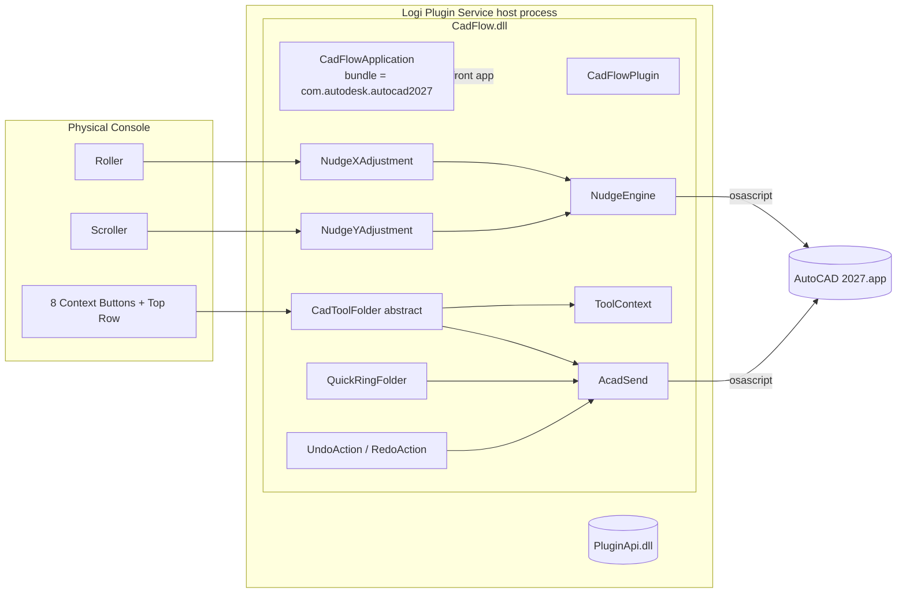

<p align="center">
  
</p>

<h1 align="center">CADFlow</h1>

<p align="center">
  <strong>A Loupedeck / Logitech MX Creative Console plugin that turns a physical console into a context-aware control surface for AutoCAD 2027 on macOS.</strong>
</p>

<p align="center">
  <a href="#license"></a>
  
  
  
  
</p>

---

## Table of Contents

- [Problem Statement](#problem-statement)
- [Solution Overview](#solution-overview)
- [Key Features](#key-features)
- [Architecture Overview](#architecture-overview)
- [Tech Stack](#tech-stack)
- [Installation](#installation)
- [Usage](#usage)
- [Example Workflows](#example-workflows)
- [Screenshots](#screenshots)
- [Folder Structure](#folder-structure)
- [Documentation Map](#documentation-map)
- [Contributing](#contributing)
- [License](#license)
- [Roadmap / Future Improvements](#roadmap--future-improvements)

---

## Problem Statement

AutoCAD on macOS has lagged behind the Windows version in terms of ribbon customization, macro recorders, and 3rd-party workflow tools. Drafters who rely on repeated drafting primitives (line, offset, trim, fillet, dimension, array) must constantly:

1. Remember — and type — short command aliases at the command line.
2. Chain together sub-options by typing single letters (`c`, `r`, `d`, `@`, etc.).
3. Break their drawing focus to reach for the keyboard or the tool palette.
4. Switch hands between mouse and keyboard dozens of times per minute.

For a **Loupedeck CT** or **Logitech MX Creative Console** user, this is a missed opportunity: the device already offers encoders, button banks, and dynamic folders perfect for discoverable, context-aware CAD controls — but no first-class AutoCAD plugin ships for macOS.

## Solution Overview

**CADFlow** is a native Logi Plugin Service plugin (`.NET 8`, Loupedeck Plugin API v4) that:

- Detects when AutoCAD 2027 is the frontmost app on macOS and automatically takes over the console.
- Exposes every common AutoCAD drafting command as a **tool folder** — eight context-aware buttons per tool, each mapped to a real sub-option of that command.
- Turns the console's **Roller** and **Scroller** wheels into continuous **X / Y pan nudges** (the `NudgeEngine`) with a velocity curve for both fine alignment and fast travel.
- Provides a dedicated **Quick Ring** folder (zoom, line-weight, layer cycle, rotate angle, scale factor, hatch scale, text height, confirm) for parameters that benefit from a one-button poke.
- Sends commands to AutoCAD via **AppleScript** (`osascript`) so that CADFlow needs no AutoCAD SDK, no ObjectARX, no LISP — it works with the stock macOS build of AutoCAD.

CADFlow is a **middleware** layer: it does not modify AutoCAD or ship a `.bundle`, and it carries no native code in AutoCAD's address space. It only automates the UI events AutoCAD already exposes.

## Key Features

- **Auto-activation** — Loupedeck switches profiles to CADFlow the moment AutoCAD becomes frontmost (via `CadFlowApplication.GetBundleName()` binding to `com.autodesk.autocad2027`).
- **Dynamic Folders per Tool** — Each tool (Line, Polyline, Circle, Arc, Polygon, Rectangle, Move, Copy, Offset, Trim, Extend, Rotate, Scale, Mirror, Fillet, Chamfer, Dimension, Align, Array, Text) has its **own** folder with 8 purpose-built context buttons.
- **Smart Toggles Mid-Command** — Ortho, Polar, OSnap, Object Tracking can be toggled **inside** an active LINE / PLINE command without cancelling, using AutoCAD Mac's verified shortcuts (`⌘L`, `⌘U`, `F3`, `⇧⌘T`).
- **Transparent Pan (`'_-pan`)** — Roller / Scroller pan the viewport while any command is running, thanks to the apostrophe prefix that forces a transparent command.
- **Velocity-Curved Nudge** — `NudgeEngine` applies a non-linear response (`FineScale + TurboCoeff · |Δ|^1.65`) so a gentle spin gives pixel-level precision and a fast spin crosses the drawing quickly.
- **Quick Ring** — Second-level shortcuts for `Zoom`, `LW+`, `Layer`, `Angle`, `Scale`, `Hatch`, `TxtH`, `Confirm`.
- **Native Tile Rendering** — Every button image is drawn procedurally in `BitmapBuilder` (no PNG assets required at runtime), keeping the plugin under 200 KB and snappy at every image size.
- **Undo / Redo on top buttons** — Dedicated `PluginDynamicCommand` instances map to `⌘Z` and `⇧⌘Z`.
- **Structured logging** — `PluginLog` wraps the Loupedeck `PluginLogFile` so every folder activation / deactivation is traceable.

## Architecture Overview



The core idea is that **every CADFlow action ultimately becomes an AppleScript** piped into `osascript`, which either types characters or presses key codes inside AutoCAD. See [`docs/architecture.md`](docs/architecture.md) for the full walk-through, data-flow, and diagrams.

## Tech Stack

| Layer | Technology |
| --- | --- |
| Language | C# 12 (`LangVersion=latest`) |
| Runtime | .NET 8 |
| Plugin API | Loupedeck / Logi Plugin API v4 (`PluginApi.dll`) |
| Host | Logi Plugin Service (macOS `LogiPluginService.app`) |
| Target application | AutoCAD 2027 for Mac (`com.autodesk.autocad2027`) |
| IPC mechanism | AppleScript via `/usr/bin/osascript` |
| Packaging | `logiplugintool pack` → `.lplug4` |
| Supported devices | `LoupedeckCtFamily` (Loupedeck CT, Logitech MX Creative Console) |
| Build | `dotnet build` (SDK-style `.csproj`, MSBuild `Copy` + `Exec` targets) |
| Icons | Procedural bitmaps via `BitmapBuilder` + optional `.svg` fallbacks in `package/actionicons/` |
| License | MIT |

## Installation

### Prerequisites

- macOS 13 or later (Apple Silicon recommended)
- [AutoCAD 2027 for Mac](https://www.autodesk.com/products/autocad/overview)
- [Logi Options+ / Logi Plugin Service](https://www.logitech.com/software/logi-options-plus.html) installed at `/Applications/Utilities/LogiPluginService.app`
- [.NET 8 SDK](https://dotnet.microsoft.com/download/dotnet/8.0) — recommended install via Homebrew:

  ```bash
  brew install --cask dotnet-sdk@8
  export DOTNET_ROOT="$(brew --prefix dotnet@8)/libexec"
  export DOTNET_ROOT_ARM64="$DOTNET_ROOT"
  export PATH="$DOTNET_ROOT:$PATH"
  ```

- macOS Accessibility & Automation permissions for `LogiPluginService` and `osascript` (System Settings → Privacy & Security → Accessibility / Automation).

### Build from source

```bash
git clone https://github.com/AlokDadhich/Cadflow.git
cd Cadflow
dotnet build src/CadFlow.csproj -c Release
```

The project file (`src/CadFlow.csproj`) does three things on post-build:

1. Copies everything under `src/package/` into the output directory.
2. Writes a `CadFlow.link` pointer into `~/Library/Application Support/Logi/LogiPluginService/Plugins/` so the service picks up the build.
3. Fires `open loupedeck:plugin/CadFlow/reload` to hot-reload the plugin.

### VSCode tasks

Open the folder in VSCode. `.vscode/tasks.json` provides:

| Task | Command |
| --- | --- |
| Build (Debug) | `dotnet build -c Debug` |
| Build (Release) | `dotnet build -c Release` |
| Package Plugin | `logiplugintool pack ./bin/Release ./My.lplug4` |
| Install Plugin | `logiplugintool install ./My.lplug4` |
| Uninstall Plugin | `logiplugintool uninstall My` |

### Verify the install

1. Open **Logi Options+** (or the Loupedeck app).
2. In the plugin list you should see **CADFlow 2.0** under *Installed Plugins*.
3. Launch AutoCAD 2027 → the console should automatically adopt the CADFlow profile (`DefaultProfile20.lp5`).
4. Press the top-left button → an Undo fires in AutoCAD.

## Usage

Once installed, CADFlow is always-on when AutoCAD is frontmost. The default profile (`src/package/profiles/DefaultProfile20.lp5`) ships with these bindings:

| Control | Binding | Behaviour |
| --- | --- | --- |
| Roller (horizontal wheel) | `NudgeXAdjustment` | Transparent pan along X |
| Scroller (vertical wheel) | `NudgeYAdjustment` | Transparent pan along Y |
| Top-left button | `UndoAction` | `⌘Z` inside AutoCAD |
| Top-right button | `RedoAction` | `⇧⌘Z` inside AutoCAD |
| Bottom-left button | `QuickRingFolder` | Opens the 8-slot Quick Ring |
| Remaining buttons | Drag-assignable tool folders (`LineTool`, `CircleTool`, `MoveTool`, …) |

Inside a tool folder, the eight buttons follow a stable convention:

| Slot | Purpose |
| --- | --- |
| `btn0`–`btn5` | Tool-specific sub-options (see the tool reference in [`docs/api.md`](docs/api.md)) |
| `btn6` | Close / back-arrow (exits the folder, cancels the command) |
| `btn7` | Confirm (sends `Enter` / key code 36 to AutoCAD) |

Assign any tool folder to a button of your choice through the Logi Options+ editor, or edit the profile file directly.

## Example Workflows

### 1. Draw a closed polyline with mid-command orthogonal lock

1. Tap the `Line` button → console enters the `Line` folder, AutoCAD starts the `LINE` command.
2. Tap `btn0` (**Ortho**) — toggles `ORTHOMODE` via `⌘L` *without* cancelling the line.
3. Click vertices in the viewport; spin the Roller/Scroller to pan while drawing.
4. Tap `btn6` (**Close**) — sends `c↵` and completes the polyline.

No keyboard touches.

### 2. Pan while zooming with the Quick Ring

1. Tap the Quick Ring button.
2. Tap `btn0` (**Zoom**) — AutoCAD's zoom prompt engages.
3. Spin the Scroller to zoom in/out; spin the Roller simultaneously to re-centre the view.
4. Tap `btn7` (**Confirm**) — accepts the new viewport.

### 3. Offset with distance memorised

1. Tap `Offset`.
2. Tap `btn0` (**Distance**), type the distance once.
3. Pick side → tap `btn6` **LastVal** (`@`) — reuses the prior distance token for the next offset.

### 4. Dimensional chain

1. Tap `Dimension`.
2. Tap `btn0` (**Linear**) — starts `dimlinear`.
3. After placing the first dimension, tap `btn5` (**Continue**) — automatically switches to `dimcontinue` to chain more dimensions along the same axis.

More walkthroughs live in [`docs/user-guide.md`](docs/user-guide.md).

## Screenshots

> *The following screenshots are placeholders — please drop the real captures into `docs/images/` using the same names and GitHub will render them.*

| File | Shows |
| --- | --- |
| `docs/images/console-home.png` | The default CADFlow layout on the Loupedeck CT home screen. |
| `docs/images/quick-ring.png` | Quick Ring folder with the 8 parameter tiles. |
| `docs/images/line-tool.png` | The Line tool folder, with Ortho / Polar / OSnap toggles lit. |
| `docs/images/in-action.gif` | A screen recording of Roller/Scroller panning while a `LINE` command is active. |

## Folder Structure

```
Cadflow/
├── MyPlugin.sln                     # Solution, single CadFlow.csproj
├── README.md                        # ← you are here
├── docs/                            # Full documentation suite
│   ├── architecture.md
│   ├── api.md
│   ├── developer-guide.md
│   ├── user-guide.md
│   └── wiki-summary.md
├── .vscode/                         # Build / package / install tasks
└── src/
    ├── CadFlow.csproj               # SDK-style project, targets net8.0
    ├── Directory.Build.props        # Global MSBuild props (LangVersion=latest)
    ├── CadFlowPlugin.cs             # Plugin entry (Load/Unload)
    ├── CadFlowApplication.cs        # ClientApplication — binds to AutoCAD 2027 bundle ID
    ├── Actions/
    │   ├── AcadSend.cs              # osascript wrapper (send keystroke / keycode / shortcut / toggle)
    │   ├── NudgeEngine.cs           # Singleton – accumulator + '_-pan' velocity curve
    │   ├── NudgeXAdjustment.cs      # Roller → FeedX
    │   ├── NudgeYAdjustment.cs      # Scroller → FeedY
    │   ├── UndoRedoActions.cs       # PluginDynamicCommand for ⌘Z / ⇧⌘Z
    │   ├── QuickRingFolder.cs       # 8-slot parameter ring
    │   ├── CadToolFolder.cs         # Abstract base + 4 group subclasses + tile renderer
    │   ├── Draw/DrawTools.cs        # Line, Polyline, Circle, Arc, Polygon, Rectangle
    │   ├── Modify/ModifyTools.cs    # Move, Copy, Offset, Trim, Extend, Rotate, Scale, Mirror, Fillet, Chamfer
    │   ├── Precision/PrecisionTools.cs # Dimension, Align
    │   └── Advanced/AdvancedTools.cs   # Array, Text
    ├── Context/
    │   └── ToolContext.cs           # Tracks currently-active CadToolFolder
    ├── Helpers/
    │   ├── PluginLog.cs             # Wrapper around Loupedeck PluginLogFile
    │   └── PluginResources.cs       # Thin facade over the embedded-assembly helpers
    └── package/                     # Shipped alongside the DLL
        ├── metadata/
        │   ├── LoupedeckPackage.yaml
        │   └── Icon256x256.png
        ├── actionicons/             # Optional SVG icons for each tool
        └── profiles/
            └── DefaultProfile20.lp5 # Ships the out-of-the-box bindings
```

## Documentation Map

| Audience | Start here |
| --- | --- |
| New user | [`docs/user-guide.md`](docs/user-guide.md) |
| New contributor | [`docs/developer-guide.md`](docs/developer-guide.md) |
| Someone reading the code | [`docs/wiki-summary.md`](docs/wiki-summary.md) |
| System integrator / reviewer | [`docs/architecture.md`](docs/architecture.md) |
| Quick class / function reference | [`docs/api.md`](docs/api.md) |

## Contributing

1. Fork the repo and create a feature branch: `git checkout -b feat/my-new-tool`.
2. Keep the C# style consistent with the existing code — *see* [`docs/developer-guide.md`](docs/developer-guide.md#coding-conventions).
3. New tool folders should:
   - Subclass one of `DrawToolFolder`, `ModifyToolFolder`, `PrecisionToolFolder`, or `AdvancedToolFolder`.
   - Expose **exactly** 8 `CtxBtn` entries, reserving slot `6` for *Close* and slot `7` for *Confirm*.
   - Use lower-case AutoCAD command aliases.
4. Run `dotnet build -c Release` — a clean build with no warnings is required.
5. Test interactively against AutoCAD 2027 on macOS. Attach a short screen recording or GIF to the PR.
6. Open a PR against `main`. Describe the intent, the command(s) it drives, and any new AppleScript paths.

## License

CADFlow is released under the [MIT License](https://opensource.org/licenses/MIT).

```
Copyright © 2026 alokd.
```

See [`src/package/metadata/LoupedeckPackage.yaml`](src/package/metadata/LoupedeckPackage.yaml) for the in-plugin metadata that the Logi Plugin Service reads.

## Roadmap / Future Improvements

The items below are open work items inferred from the current code base. They are not promises, but they capture obvious gaps a new maintainer might want to pick up.

- **Live parameter adjustments on wheels inside tool folders.** Today, `QuickRingFolder` only drives buttons; most tools would benefit from encoder adjustments (e.g. `Rotate` + Roller = live angle spin).
- **Dynamic SVG icon loading.** `src/package/actionicons/*.svg` exists but is currently redundant with the procedural `BitmapBuilder` tiles. Use `PluginResources.ReadImage` to swap in bespoke SVGs.
- **Application status detection.** `CadFlowApplication.GetApplicationStatus()` returns `ClientApplicationStatus.Unknown`; wiring real status (hit-testing the AutoCAD process with `pgrep` or NSRunningApplication) unlocks automatic profile activation in more edge cases.
- **Windows support.** All IPC goes through `osascript`, which is macOS-only. A Windows port would route commands via `AutoCAD.Application` COM automation or `SendInput`.
- **Configurable AutoCAD bundle ID.** `AcadApp` and `GetBundleName` are hard-coded to 2027. Accept an override via plugin settings so 2025/2026/future builds work too.
- **Unit + integration tests.** The repo currently ships no test project. A future PR could add an `xUnit` suite that mocks `AcadSend` to verify slot→command mapping for every `CtxBtn[]`.
- **Profile export.** `DefaultProfile20.lp5` is binary. A future contribution could reverse it into a YAML round-trip so button remapping can be version-controlled.

---

*Built for drafters who would rather spin a dial than type `-pan⏎0,0⏎`.*
