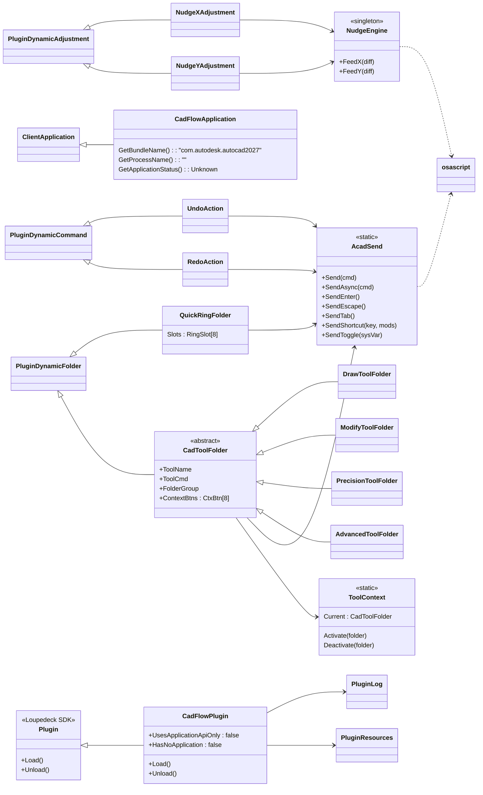
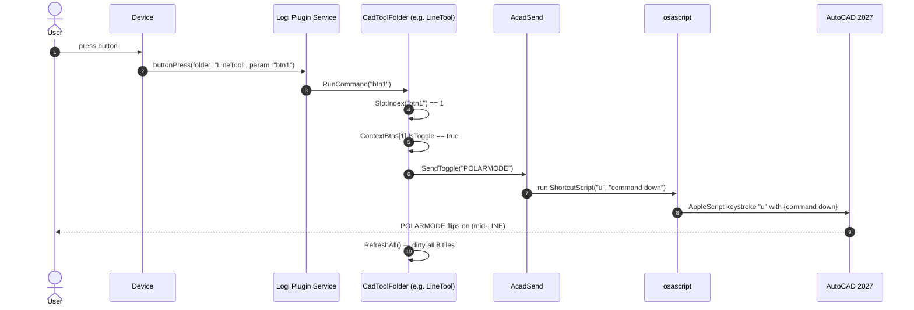
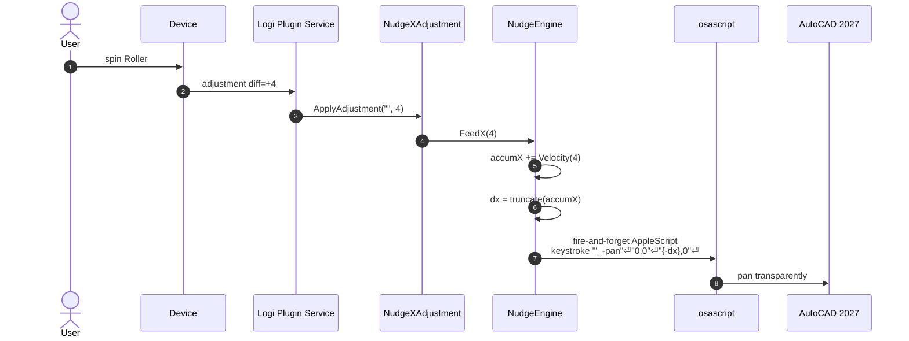
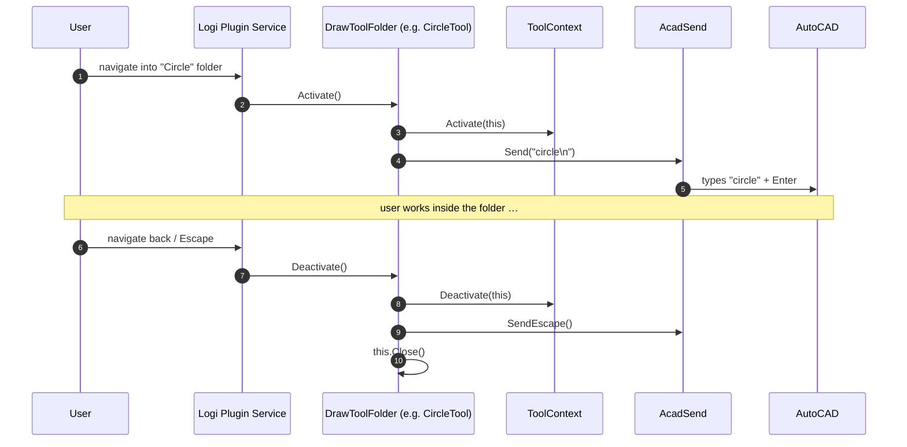
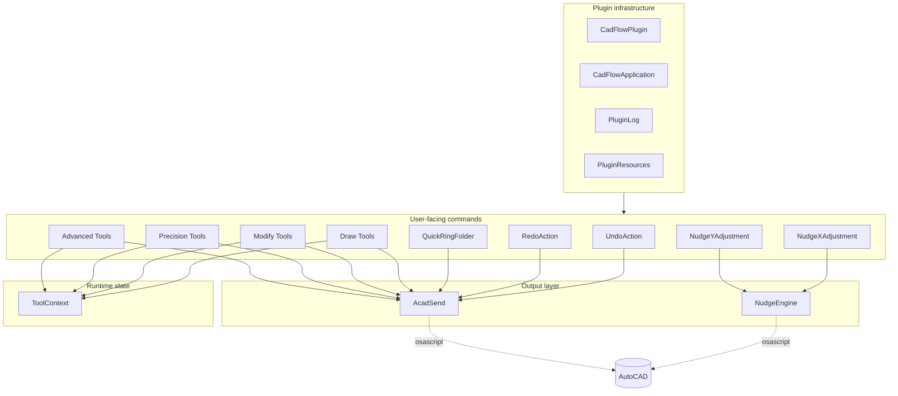
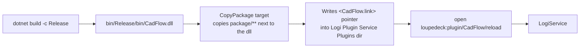

# CADFlow — Architecture

This document explains **how CADFlow is structured**, **how events flow through the plugin**, and **how it reaches AutoCAD** without using an AutoCAD SDK.

> Scope: everything in `src/`. File references use `src/...` paths so you can click straight through on GitHub.

---

## 1. System Context

CADFlow sits between three distinct processes on macOS:

```mermaid
flowchart LR
    subgraph User
        H[Hands on Loupedeck CT / MX Creative Console]
    end

    subgraph HW[Device firmware]
        Dev[Loupedeck / Logi Device]
    end

    subgraph LogiService[Logi Plugin Service.app]
        Core[Plugin host core]
        Api[(PluginApi.dll)]
        CadFlow[CadFlow.dll]
    end

    subgraph macOS
        SysEv[System Events]
    end

    subgraph Acad[AutoCAD 2027.app]
        Cmd[Command line / keyboard dispatcher]
        Viewport[Drawing viewport]
    end

    H --> Dev -->|USB HID| Core
    Core --> Api --> CadFlow
    CadFlow -->|osascript process| SysEv
    SysEv -->|keystroke / key code| Cmd --> Viewport
```

Four one-way hops:

1. **Hand** moves a control on the device.
2. **Device firmware** forwards the event to Logi Plugin Service over USB HID.
3. **Logi Plugin Service** invokes the right `PluginDynamic{Command,Folder,Adjustment}` in `CadFlow.dll` through `PluginApi.dll`.
4. **CadFlow.dll** spawns `osascript`; AppleScript tells **System Events** to deliver keystrokes to **AutoCAD 2027**.

CADFlow never links against AutoCAD. All communication is one-way UI-automation: the plugin *writes* keystrokes, it does not read AutoCAD state back. The only AutoCAD-side feedback loop is the drafter's own eyes.

---

## 2. Component Breakdown

| Component | File | Role |
| --- | --- | --- |
| `CadFlowPlugin` | [`src/CadFlowPlugin.cs`](../src/CadFlowPlugin.cs) | Plugin entry point. Initializes `PluginLog` and `PluginResources` in its constructor. Has no per-load or per-unload logic. |
| `CadFlowApplication` | [`src/CadFlowApplication.cs`](../src/CadFlowApplication.cs) | `ClientApplication` subclass bound to AutoCAD 2027's macOS bundle ID. The Logi Plugin Service uses this to decide when CADFlow is the active plugin. |
| `AcadSend` | [`src/Actions/AcadSend.cs`](../src/Actions/AcadSend.cs) | The only place that shells out to `osascript`. All tool buttons, toggles, Enter / Escape / Tab and modifier-key shortcuts go through it. |
| `NudgeEngine` | [`src/Actions/NudgeEngine.cs`](../src/Actions/NudgeEngine.cs) | Singleton holding the fractional-pixel accumulators for X and Y. Translates raw encoder deltas into transparent `'_-pan` commands via a direct inline AppleScript. |
| `NudgeXAdjustment` / `NudgeYAdjustment` | [`src/Actions/NudgeXAdjustment.cs`](../src/Actions/NudgeXAdjustment.cs) / [`NudgeYAdjustment.cs`](../src/Actions/NudgeYAdjustment.cs) | Tiny `PluginDynamicAdjustment`s that forward their `diff` into `NudgeEngine.FeedX / FeedY`. |
| `UndoAction` / `RedoAction` | [`src/Actions/UndoRedoActions.cs`](../src/Actions/UndoRedoActions.cs) | Top-row buttons. Draw their own tiles and fire `⌘Z` / `⇧⌘Z` through `AcadSend.SendShortcut`. |
| `QuickRingFolder` | [`src/Actions/QuickRingFolder.cs`](../src/Actions/QuickRingFolder.cs) | 8-slot parameter folder. Each slot is declared by a `RingSlot` record (label, up command, down command, accent colour). |
| `CadToolFolder` | [`src/Actions/CadToolFolder.cs`](../src/Actions/CadToolFolder.cs) | Abstract parent of every per-tool folder. Owns: activation lifecycle, button name generation, slot-index parsing, tile rendering, colour semantics, and the shared icon renderer. |
| `DrawToolFolder`, `ModifyToolFolder`, `PrecisionToolFolder`, `AdvancedToolFolder` | same file | Thin subclasses that only override `FolderGroup`. They exist to group tools in the Logi Options+ UI (`CAD Draw`, `CAD Modify`, etc.). |
| `LineTool`, `CircleTool`, …, `ChamferTool`, `DimensionTool`, `ArrayTool` | [`src/Actions/Draw/DrawTools.cs`](../src/Actions/Draw/DrawTools.cs), [`Modify/ModifyTools.cs`](../src/Actions/Modify/ModifyTools.cs), [`Precision/PrecisionTools.cs`](../src/Actions/Precision/PrecisionTools.cs), [`Advanced/AdvancedTools.cs`](../src/Actions/Advanced/AdvancedTools.cs) | Concrete tool folders. Each declares `ToolName`, `ToolCmd`, and a `CtxBtn[8]`. |
| `ToolContext` | [`src/Context/ToolContext.cs`](../src/Context/ToolContext.cs) | Static registry of the currently-open `CadToolFolder`. Enables future features like a global "Confirm" button that closes whatever is active. |
| `PluginLog` | [`src/Helpers/PluginLog.cs`](../src/Helpers/PluginLog.cs) | Facade over Loupedeck's `PluginLogFile`. Gives `Verbose / Info / Warning / Error` static methods. |
| `PluginResources` | [`src/Helpers/PluginResources.cs`](../src/Helpers/PluginResources.cs) | Facade over the Loupedeck assembly helpers for finding and reading embedded files (SVGs, profiles). |

---

## 3. Data Flow — Three Representative Paths

### 3.1 Button press inside a tool folder

Key points:

- `RunCommand` dispatches purely on `CtxBtn.IsToggle` / `CtxBtn.Cmd == "TAB"` / string content.
- Slot **7** is hard-coded to `AcadSend.SendEnter()` — every tool has a Confirm.
- Slot **6** is hard-coded in the tile renderer to draw a "back-arrow" — the abstract base is opinionated about this layout.

### 3.2 Roller / Scroller pan

Why the pan is built differently than `AcadSend`:

- `NudgeEngine` uses `ProcessStartInfo` with a single `-e` string — **no temp file**, **no delay**, **fire-and-forget** — because encoder events can arrive at tens of Hz.
- The apostrophe-dash (`'_-`) prefix tells AutoCAD to run `pan` transparently (inside the currently active command, without ending it) and in the **non-localized command name space** (underscore) so it works on any localized install.
- The pipeline is rate-limited by the *accumulator*: fractional pixels are retained between calls so a slow spin still eventually fires.

### 3.3 Folder activation / deactivation

Activation-time side-effects are intentional: as soon as the folder opens on the console, AutoCAD is already *in* the matching command. The user's very next click on an 8-slot button is therefore meaningful.

---

## 4. Module Interactions

- `Core` is infrastructure; it is *read* by other modules and does not depend on anything further out.
- `Surface` classes are 1-to-1 with physical controls.
- `Engine` concentrates the only two places that talk to `osascript`.
- `State` is a single static registry (`ToolContext`) kept deliberately minimal — adding more session state should force a broader design discussion.

---

## 5. Hardware / Software Integration

| Layer | What it does | Bound to |
| --- | --- | --- |
| **Physical device** | Sends HID events over USB. | Any supported `LoupedeckCtFamily` device (Loupedeck CT, Logitech MX Creative Console). |
| **Logi Plugin Service** (`LogiPluginService.app`) | Translates HID events into high-level callbacks (press, release, adjustment) and hosts managed plugins. | macOS, accessed through `PluginApi.dll`. |
| **`CadFlow.dll`** | Publishes commands, folders, adjustments, and application definition. | `net8.0`, references `PluginApi.dll`. |
| **`osascript`** | Executes AppleScript. | `/usr/bin/osascript`, ships with macOS. |
| **System Events** | AppleScript entry point for synthetic keystrokes. | Requires Accessibility + Automation permission for `LogiPluginService`. |
| **AutoCAD 2027** | Receives keystrokes and interprets them against its current prompt. | Identified by bundle `com.autodesk.autocad2027`. |

### Why AppleScript?

AutoCAD for Mac does **not** expose an ObjectARX SDK, and its `.bundle` Objective-C/LISP APIs are not accessible without entering the app's address space. AppleScript is the only sanctioned, stable IPC path on macOS, so CADFlow uses it exclusively.

### Transparent vs. non-transparent commands

AutoCAD differentiates between:

| Form | Example | Effect |
| --- | --- | --- |
| Plain | `pan⏎` | Starts a new command; cancels whatever was active. |
| Underscore | `_pan⏎` | Same as plain but uses the non-localized command name. |
| Dash | `-pan⏎` | Forces the command-line version (skips dialog / grip flow). |
| **Transparent** | `'_-pan⏎0,0⏎dx,dy⏎` | Runs **inside** the currently-active command without ending it. |

CADFlow deliberately mixes the two styles:

- `AcadSend.Send(...)` uses plain commands — callers expect AutoCAD to enter that command fresh.
- `NudgeEngine.SendPan(...)` uses the transparent `'_-pan` form so panning never aborts a running `LINE`/`PLINE`/`MOVE`.

---

## 6. Packaging & Load

- The `Directory.Build.props` redirects `BaseOutputPath` to `$(SolutionDir)../bin/`, so the solution root's `bin/` (not `src/bin/`) receives output.
- `CopyPackage` after post-build mirrors `package/metadata`, `package/profiles`, and `package/actionicons` beside the DLL. These are required by the Logi Plugin Service to surface metadata (`LoupedeckPackage.yaml`) and ship default profile (`DefaultProfile20.lp5`).
- The `.link` file mechanism lets Logi Plugin Service pick up a dev build without copying the DLL into the Plugins directory — a symlink-style dev workflow.

---

## 7. Extension Points

If you are extending the plugin, the clean seams are:

1. **Adding a tool** — subclass one of `DrawToolFolder`, `ModifyToolFolder`, `PrecisionToolFolder`, `AdvancedToolFolder` and supply a `CtxBtn[8]` (see [`docs/developer-guide.md`](developer-guide.md)).
2. **Adding a toggle mid-command** — extend the `switch` in `AcadSend.SendToggle` with a new sysvar → script mapping.
3. **Changing pan feel** — tune `FineScale`, `TurboCoeff`, `Exponent`, `MaxDelta` in [`NudgeEngine.cs`](../src/Actions/NudgeEngine.cs).
4. **New top-level button** — create a `PluginDynamicCommand` like `UndoAction` / `RedoAction` and assign it in the profile.
5. **Smarter Quick Ring slots** — edit the `RingSlot[] Slots` array in [`QuickRingFolder.cs`](../src/Actions/QuickRingFolder.cs).

---

## 8. Assumptions & Limitations

These are explicitly documented because they shape the architecture and should be revisited if they change:

- **Frontmost app = AutoCAD 2027.** CADFlow does not disambiguate between multiple AutoCAD instances or versions. `CadFlowApplication.GetBundleName()` pins `com.autodesk.autocad2027`.
- **US-layout keyboard commands.** `AcadSend.Sanitise` lower-cases and escapes input, but AutoCAD keyboard shortcuts (`⌘L`, `⌘U`, `⇧⌘T`) assume a standard US-ish layout.
- **macOS only.** All IPC is `osascript`. Windows would need a separate transport (see `csproj` — there is no Windows-specific implementation of the keystroke layer, only MSBuild conditions for the plugin path).
- **One active tool folder at a time.** `ToolContext` stores a single `Current` reference.
- **No return channel from AutoCAD.** CADFlow cannot query system variables or selection state; it only writes.
- **Logi Plugin Service must already be running.** The plugin has no facility to launch or manage the service itself.
